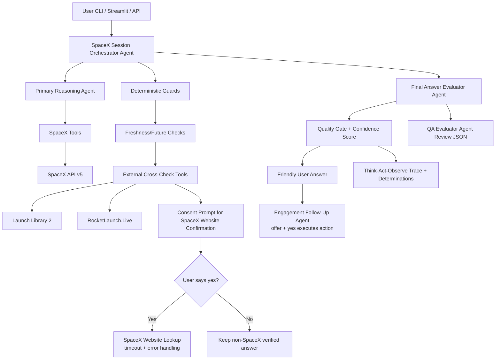

# Architecture Design

This document explains every component in the system, what it does, and why I chose to build it that way.

---

## Architecture Diagram

---

## Components

### User CLI / Streamlit / API

**What it is:**
Three different ways for a user to talk to the agent — a terminal CLI, a visual Streamlit web app, and an HTTP API endpoint.

**What it does:**
Accepts a user message and returns the agent's answer and trace. All three share the same underlying session logic so behaviour is identical regardless of interface.

**Why I built it this way:**
I wanted to show the agent works in multiple contexts, not just a single demo script. The CLI is fast for testing, Streamlit is good for visual demos, and the API shows it can be integrated into other systems. A single session class (`SpaceXAgentSession`) powers all three so there is no duplicated logic.

---

### SpaceX Session Orchestrator Agent

**What it is:**
The central controller in `src/agent.py`. Every user message goes through here.

**What it does:**
- Manages multi-turn conversation memory (stores messages across turns).
- Detects what kind of question was asked (latest launch, next launch, year query, mission query).
- Routes the question through the right validation path.
- Holds pending state between turns (e.g. waiting for a yes/no answer from the user).
- Coordinates the Primary Reasoning Agent, Deterministic Guards, and post-answer agents in sequence.

**Why I built it this way:**
Without a central orchestrator, each component would need to know about every other component. By having one controller that owns the flow, changes to one validation path do not break others. It also means conversation state (pending consent prompts, pending engagement actions) lives in one place and is easy to inspect and debug.

---

### Primary Reasoning Agent

**What it is:**
A LangChain ReAct agent backed by the Gemini LLM.

**What it does:**
- Interprets the user's question.
- Decides which tools to call and in what order.
- Calls multiple tools if needed (e.g. get launch → get rocket details → get launchpad details).
- Synthesises the raw tool results into a draft answer.

**Why I built it this way:**
ReAct (Reasoning + Acting) is the standard pattern for tool-using LLM agents. It forces the model to reason step by step, pick a tool, observe the result, and decide whether to keep going or stop. This produces an auditable Think-Act-Observe trace rather than a black-box single response. I chose Gemini because it's available via a simple API key and handles multi-tool reasoning reliably.

---

### SpaceX Tools

**What they are:**
A set of Python functions registered as LangChain tools in `src/tools.py`.

**What they do:**
- `get_latest_launch` — fetches the most recent SpaceX launch from the API.
- `get_next_launch` — fetches the next upcoming SpaceX launch from the API.
- `get_launches_in_year` — fetches all launches for a given year.
- `get_last_failed_launch` — fetches the most recent failed launch.
- `get_rocket` — fetches rocket details by ID.
- `get_launchpad` — fetches launchpad details by ID.
- `get_latest_launch_external` / `get_next_launch_external` — cross-checks against non-SpaceX sources.

**Why I built them this way:**
Each tool does one specific thing. This keeps the reasoning agent's decisions simple and auditable — you can see exactly which tool was called and what it returned. Separating tools also means they can be reused in different query paths without duplicating API calls.

---

### SpaceX API v5

**What it is:**
The primary data source. A free public REST API at `https://api.spacexdata.com/v5`.

**What it does:**
Returns structured launch, rocket, and launchpad data as JSON.

**Why I use it:**
It is the most authoritative SpaceX data source available publicly. However, it is a community-maintained API and can become stale — which is why the system has freshness guards and external cross-checks to handle that case.

---

### Deterministic Guards

**What they are:**
Pure Python logic in `src/agent.py` that runs after the Primary Reasoning Agent finishes, before the answer reaches the user.

**What they do:**
Check the answer and trace for specific known failure conditions:
- Is a "latest" launch result actually recent, or is it months out of date?
- Is a "next" launch date actually in the future, or is it already in the past?
- Did a year-based query return any launches at all?
- Did a mission-specific query return actual data, or just a bare confirmation prompt?

If a failure condition is found, the guard redirects the flow to either an external cross-check or a user consent prompt.

**Why I built them this way:**
LLMs do not reliably detect data staleness on their own. If the SpaceX API returns a "next launch" date from six months ago, the LLM will happily report it as the upcoming launch. These guards are deterministic — they run the same logic every time regardless of what the LLM thinks — so the output is predictable and testable. This is the key decision that separates a production-quality agent from a demo that works most of the time.

---

### Freshness / Future Checks

**What they are:**
Specific guard conditions within the Deterministic Guards layer.

**What they do:**
- **Freshness check:** Latest launch data older than 180 days is considered stale. The guard flags it and triggers an external cross-check.
- **Future check:** Next launch data with a date already in the past is considered stale. Same trigger.
- **Year check:** If `get_launches_in_year` returns zero results, the guard flags this and offers a website consent prompt.
- **Mission check:** If the agent's answer contains only a bare consent question (no actual data), the guard rewrites it to first explain the limitation before asking.

**Why I built them this way:**
Each query type has a different definition of "valid". A latest launch result is valid if it is recent. A next launch result is valid only if it is in the future. Separating these checks makes each one focused and independently adjustable — tightening the staleness threshold for latest launches does not affect how next-launch checks work.

---

### External Cross-Check Tools

**What they are:**
Two additional data sources called only when the primary SpaceX API fails a guard check.

**What they do:**
- **Launch Library 2:** A community-maintained launch tracking database. Returns structured launch data with mission name, date, and status.
- **RocketLaunch.Live:** A separate real-time launch tracking service. Used as a second opinion when Launch Library 2 also fails.

**Why I built them this way:**
Rather than immediately falling back to web scraping, I check two structured APIs first. Structured data is more reliable than scraping and faster to parse. Only if these also fail to produce a valid answer does the system ask the user for consent to check the SpaceX website. This creates a layered fallback: primary API → structured external APIs → website (with consent).

---

### Consent Prompt for SpaceX Website Confirmation

**What it is:**
A user-facing message asking permission before scraping the SpaceX website.

**What it does:**
Pauses the flow and waits for a yes or no from the user. The exact message always explains the limitation first:

> "I was not able to get the information you requested from the primary source. I could look to see if it is available on the SpaceX website. Would you like me to search there?"

**Why I built it this way:**
Automatically scraping websites without the user's knowledge is bad practice — it can be slow, error-prone, and unexpected. By asking first, the user understands why the normal answer was not available. It also avoids unnecessary web requests if the user does not need the most current data. The consent step is also how mission-specific and year-based queries surface their limitation clearly instead of silently asking for confirmation.

---

### User Says Yes? (Decision Gate)

**What it is:**
Intent detection for the user's yes/no response on the next turn.

**What it does:**
- Recognises affirmative responses: "yes", "yep", "sure", "go ahead", "please do", etc.
- Recognises negative responses: "no", "nope", "don't", "cancel", etc.
- If the response is neither, clears the pending state and treats the message as a new question.

**Why I built it this way:**
Users say yes in many different ways. A simple `== "yes"` check would miss most real responses. Using regex patterns for common affirmatives and negatives makes the gate robust without overcomplicating it. If the input is ambiguous (e.g. the user just asked a different question), forcing a yes/no loop would block the conversation unnecessarily. Treating unclear input as a new question is the better default — the user can always ask again if they did want the website searched.

---

### SpaceX Website Lookup (timeout + error handling)

**What it is:**
A web scraper that reads launch data directly from the SpaceX website, run only after user consent.

**What it does:**
Fetches the latest or next launch information from the SpaceX website. Runs inside a `ThreadPoolExecutor` with a 12-second timeout so it cannot hang the session. If it times out or throws an error, it returns a structured error dict and the session continues with a safe fallback message.

**Why I built it this way:**
Web scraping is inherently unreliable — pages change, connections fail, and responses can be slow. Wrapping it in a timeout-controlled thread prevents any single slow request from blocking the entire session. Returning a structured error dict (rather than raising an exception) means the calling code always gets a predictable shape to work with, regardless of what went wrong.

---

### Keep non-SpaceX Verified Answer

**What it is:**
The fallback path when the user declines the website lookup.

**What it does:**
If the external cross-check tools (Launch Library 2 / RocketLaunch.Live) found a usable answer before the consent prompt appeared, that answer is kept and shown to the user with a note about the source. If no external answer was available either, the agent says so clearly rather than returning stale or fabricated data.

**Why I built it this way:**
The user should never be left with nothing just because they said no. If a cross-check source already found a valid answer, it would be wrong to discard it. Clearly labelling the source (e.g. "from Launch Library 2") also keeps the answer transparent and auditable.

---

### Final Answer Evaluator Agent

**What it is:**
An LLM-powered agent that reviews the draft answer before the user sees it.

**What it does:**
Receives the original user question, the draft answer, and the full tool trace. Returns a structured JSON verdict:
- `intent_match` — did the answer actually address what was asked?
- `grounded_in_trace` — is every claim in the answer backed by a real tool observation?
- `verdict` — pass or fail.
- `confidence` — low, medium, or high.
- `issues` — a list of specific problems.
- `recommended_action` — keep, revise, or ask for clarification.
- `revised_answer` — a corrected version if revision was recommended.

**Why I built it this way:**
LLMs sometimes generate answers that sound plausible but contain details that were never in the tool results — this is called hallucination. The evaluator catches this by explicitly checking whether every meaningful claim can be traced back to an observation in the tool call log. It also catches cases where the answer drifted off-topic from what the user actually asked. Having this as a separate LLM call (rather than self-evaluation) means the model is reviewing its own work with a fresh prompt focused purely on accuracy, not on being helpful.

---

### Quality Gate + Confidence Score

**What it is:**
Structured metadata derived from the Final Answer Evaluator's output.

**What it does:**
Converts the evaluator verdict into a numeric confidence score (0–100) using a formula that accounts for:
- Base confidence level (high → 88, medium → 72, low → 56)
- Pass/fail verdict adjustment (pass +8, fail -18)
- Penalty if a fallback answer was used (-20)
- Penalty per issue reported (-4 each, capped at 10 issues)

This score and the pass/fail status are returned in every API response, shown in the Streamlit UI, and printed in the CLI trace.

**Why I built it this way:**
A binary pass/fail verdict loses information. A score gives callers a way to decide how much to trust an answer — for example, a score of 90 with a pass verdict is more reliable than a score of 62 with a pass verdict. Making the formula deterministic (no LLM involved in scoring) means the score is consistent and auditable.

---

### QA Evaluator Agent Review JSON

**What it is:**
The raw structured JSON output from the Final Answer Evaluator, stored in the trace.

**What it does:**
Provides full transparency into why the evaluator gave the verdict it did. Visible in the API response (`qa_review` field), the Streamlit trace panel, and the CLI verbose output.

**Why I built it this way:**
Without the raw evaluator output, a reviewer would only see a pass/fail score with no explanation. Surfacing the full JSON — including which specific issues were flagged and what revision was recommended — makes the system auditable. For an interview context, it also makes the evaluation logic visible rather than hidden inside a black box.

---

### Friendly User Answer

**What it is:**
The final answer that gets shown to the user, separate from the internal technical answer.

**What it does:**
Takes the validated technical answer and rewrites or formats it for a general audience. Uses structured formatting (plain language, friendly dates like "April 2, 2026 at 11:52 UTC") and avoids technical jargon. For known query types (latest launch, next launch, year queries, failed launches), it uses templates that pull directly from tool observations rather than relying on the LLM to rewrite correctly.

**Why I built it this way:**
The internal answer from the reasoning agent is often formatted for accuracy rather than readability — it may contain raw field names, JSON fragments, or overly technical phrasing. Separating the user-facing answer from the internal answer means the evaluation layer works on the accurate version while the user sees a readable version. It also means the friendly answer can be improved without touching the evaluation logic.

---

### Engagement Follow-Up Agent

**What it is:**
An LLM-powered agent that runs after every completed answer turn.

**What it does:**
Proposes one optional follow-up action the user might find useful. For example, after answering a question about the latest launch, it might offer to look up the next scheduled launch. The offer is appended to the user-facing answer:

> "If you're interested, I can tell you about the next SpaceX launch. Would you like me to do that?"

If the user says yes on the next turn, the agent executes the suggested query automatically. If the user says no, it dismisses the offer and continues normally.

**Why I built it this way:**
A conversational agent that only answers direct questions and then goes silent creates a flat experience. Real conversations have natural continuations. By suggesting a relevant next step, the agent feels more like an assistant and less like a search box. The follow-up must be a real query the agent can actually execute (it is restricted to supported tool types — latest launch, next launch, failed launch, year queries) rather than an open-ended offer it might fail to fulfil.

---

### Think-Act-Observe Trace + Determinations

**What it is:**
A structured log of every decision, tool call, and observation produced during a turn.

**What it does:**
Records:
- **Action entries** — which tool was called and with what input.
- **Observation entries** — what the tool returned.
- **Determination entries** — the result of each guard or evaluation check (e.g. `freshness_check: pass`, `next_launch_future_guard: fail`).

This trace is returned in every API response and displayed in the Streamlit trace panel and CLI output.

**Why I built it this way:**
Without a trace, the agent is a black box — you can see the final answer but not why it was produced. The trace makes every step visible and auditable. Determination entries are particularly important because they show exactly which guard triggered a fallback and why — for example, "primary next-launch date is 47 days in the past" explains to the user and to a reviewer why the system fell back to an external source. This transparency is also a key part of what makes the system trustworthy rather than just functional.

---

## Why This Structure As a Whole

A simpler version of this system would be: take user input → call the SpaceX API → show the result. That works when the API is fresh and the question is simple.

The additional layers exist to handle the cases where that simple version fails:

| Problem | Layer That Handles It |
|---|---|
| API data is months out of date | Freshness / Future Guards |
| External sources also fail | User Consent + Website Lookup |
| LLM drifts off topic or hallucinates | Final Answer Evaluator |
| Answer is technically correct but hard to read | Friendly User Answer Builder |
| User types "lauch" instead of "launch" | Fuzzy Keyword Matching |
| User asks an ambiguous question | Clarification Guard |
| Conversation feels flat and one-directional | Engagement Follow-Up Agent |

Each layer has a single responsibility, is independently testable, and does not depend on the others working correctly. This means when something fails, the trace shows exactly where and why — rather than producing a silent wrong answer.
