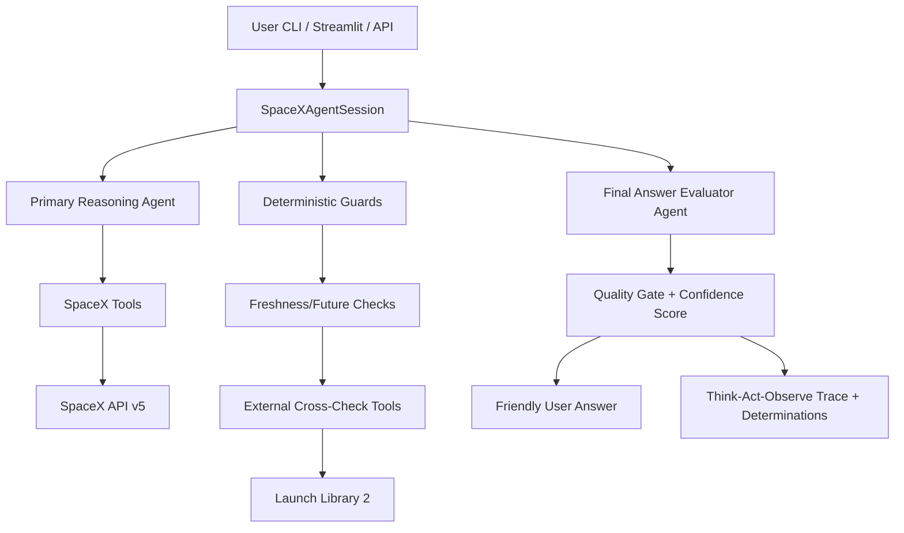

# SpaceX Agentic Hiring Test Solution

This project implements a conversational AI agent for SpaceX questions using live SpaceX API data.

It is built to demonstrate **agentic behavior** required by the challenge:
- Conversational memory across turns
- Tool-based factual grounding
- Multi-step reasoning with multiple tool calls
- Clarifying questions for ambiguous input
- Error handling and graceful fallback
- Visible Think-Act-Observe trace (not a single input-output line)
- Automatic freshness validation for "latest launch" answers with secondary-source cross-check

## Stack

- Python
- LangChain ReAct agent
- SpaceX v5 API (`https://api.spacexdata.com/v5`)
- CLI chat interface
- Optional FastAPI web endpoint
- Streamlit demo app

## Architecture Diagram



## Project Files

- `src/spacex_client.py`: robust SpaceX API wrapper
- `src/tools.py`: agent tools (launch/rocket/launchpad search, year queries, etc.)
- `src/agent.py`: ReAct prompt + executor + memory
- `src/chat_cli.py`: terminal chatbot with reasoning trace output
- `src/api_server.py`: optional HTTP interface with per-session memory
- `src/demo_script.py`: runs exact interview sample questions automatically with traces
- `src/static/index.html`: lightweight web page to visualize Action/Observation timeline
- `src/streamlit_app.py`: Streamlit chat app with per-turn trace visualization

## Setup

1. Install dependencies:

```bash
pip install -r requirements.txt
```

2. Configure environment:

```bash
copy .env.example .env
```

Then edit `.env` and set `GEMINI_API_KEY`.

## Run CLI (recommended for interview demo)

```bash
python -m src.chat_cli
```

Sample prompts:
- `When was the last SpaceX launch?`
- `What's the next SpaceX launch and where is it happening?`
- `How many launches did SpaceX complete in 2024?`
- `Which rocket was used for the Starlink 9-1 mission?`
- `Show me all successful Falcon 9 launches.`
- `Tell me about the most recent launch from Vandenberg.`

The CLI prints:
- Final answer
- Detailed Think-Act-Observe tool trace per turn

## Run Auto Demo Script

```bash
python -m src.demo_script
```

This runs the exact sample prompts from the hiring prompt and prints:
- Question
- Final answer
- Step-by-step Action and Observation trace

## Run Submission Proof Log (One Command)

```bash
python -m src.submission_proof
```

This prints a requirement-by-requirement proof log and embeds the formal validation report.

## Run API Server (optional)

```bash
uvicorn src.api_server:app --reload
```

Then open:
- `http://127.0.0.1:8000/`

Endpoints:
- `GET /health`
- `POST /chat`

Example request body:

```json
{
  "session_id": "candidate-demo-1",
  "message": "What was the outcome of the first Falcon Heavy launch?"
}
```

Response includes `answer` and a `trace` array containing tool calls and observations.

## Run Streamlit App

```bash
streamlit run src/streamlit_app.py
```

### Streamlit Secrets (Recommended)

For local Streamlit development:

1. Create `.streamlit/secrets.toml` from `.streamlit/secrets.toml.example`.
2. Add your real keys in `.streamlit/secrets.toml`.
3. Keep `.streamlit/secrets.toml` out of git (already ignored in `.gitignore`).

Example:

```toml
GEMINI_API_KEY = "your_gemini_api_key_here"
GEMINI_MODEL = "gemini-2.0-flash"
SPACEX_API_BASE_URL = "https://api.spacexdata.com/v5"
```

For Streamlit Community Cloud:

1. Open your app settings.
2. Go to `Secrets`.
3. Paste the same TOML content and save.

The app reads secrets with `st.secrets` and uses them at runtime.

The Streamlit app provides:
- conversational chat
- session reset button
- interview sample question picker
- Action/Observation trace visualization per turn

## Validation

Run formal validation checks:

```bash
python -m src.validation_runner
```

See full validation notes in `VALIDATION.md`.

## Requirement Coverage

1. Conversational Agent:
- CLI, Streamlit, and API chat interfaces
- session memory maintained across turns

2. Domain: SpaceX:
- live data answers across launch, rocket, launchpad, and location queries

3. Tool Design:
- dedicated tools for API calls, parsing, filtering, and fallback handling

4. LLM Integration:
- intent interpretation + tool orchestration + grounded answer synthesis

5. Agentic Behavior:
- multi-tool reasoning loops
- deterministic freshness/future guards
- clarifying questions for ambiguous launch input
- final-answer evaluator agent with quality gate

6. Validation:
- repeatable validation runner and report (`src/validation_runner.py`, `VALIDATION.md`)

## Beyond The Ask

- Quality Gate metadata with confidence score (0-100)
- Friendly customer-facing answers separated from technical trace
- Friendly date formatting in user answers and trace hints
- External cross-source verification to mitigate stale primary API data

## Notes for Interviewers

- Answers are grounded in real tool outputs from SpaceX API.
- Agent behavior is observable via verbose traces and returned intermediate steps.
- The design intentionally keeps tools granular so the agent can chain them autonomously.
